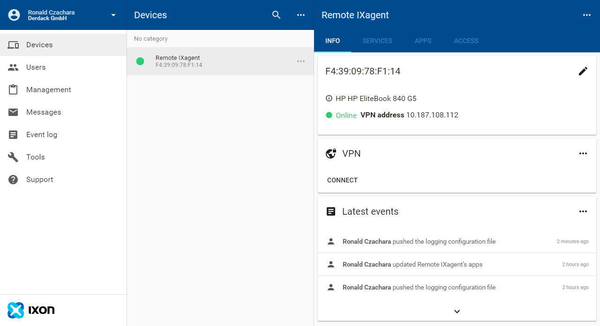
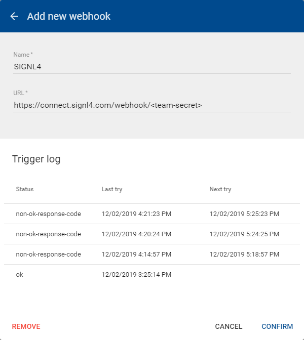

# Mobile Alarmierung per App, SMS und Anruf für IXON Cloud

Mobile Alarmierung mit Tracking, Bereitschafts-Planung und Eskalation für IXON Cloud.

## Warum SIGNL4


IXON ist eine All-in-One-Lösung für die nahtlose Integration zwischen Cloud, Edge-Verbindung und Maschine. Die No-Code-IIoT-Plattform bietet Fernzugriff per VPN, Cloud Data Logging, Daten-Visualisierung und mehr. Relevante Maschinen-Daten können unkompliziert ausgelesen werden. Die Integration dieser leistungsstarken IoT-Plattform mit SIGNL4 kann Ihren täglichen Betrieb durch die zuverlässige Alarmierung mobiler Teams verbessern, egal wo sich diese befinden.
 


## So funktioniert es

Alles, was für die Verknüpfung von Particle mit IXON nötig ist, ist eine Webhook in Ihrem IXON-Portal der durch relevante Messages ausgelöst wird. Dies ermöglicht die Übertragung der Daten an SIGNL4 und somit die Alarmierung Ihres SIGNL4-Teams.

## Integration

- Alarmierung von Wartungsteams in SIGNL4 per mobilem Push, Text und Sprache
- Anbindung an SIGNL4 per Email (SMTP API)
- Transparente Quittierung in der mobilen App
- Eskalation von Alarmen wenn eine bestimmte Zeit verstrichen ist
- Team-Kommunikation innerhalb von Alarmen
- Nachvollziehbarkeit der Störungs-Behebung
- Integrierte Bereitschafts-Planung, um die richtigen Personen zur richtigen Zeit zu alarmieren
- Alarmierung über kritische IoT-Status
- Mögliche Zwei-Wege-Integration zur Interaktion mit Geräten

## Szenarien

- Industrielles IoT
- Industrie 4.0
- IoT Service Benachrichtigung
- IoT Geräte-Management
- Produktion, Versorgung, Öl und Gas, Landwirtschaft, etc.

## Und so funktioniert es

### Integration von SIGNL4 mit IXON Cloud

In unserem Beispiel benutzen wir den IXagent, einen Software-Agent für die IXON Cloud Plattform, um Temperatur-Daten zu simulieren. Wenn die Temperatur zu hoch ist, senden wir einen Alarm an unser SIGNL4-Team. Sie können jedoch auch einen IXrouter, IXONs Edge-Gateway verwenden.

SIGNL4 ist eine mobile App mit der Teams schneller und effektiver auf kritische Alarme, technische Störungen und dringende Service-Aufträge reagieren können. Holen Sie sich die App unter https://www.signl4.com.


### Voraussetzungen

Ein SIGNL4-Konto (https://www.signl4.com)

Ein IXON Cloud Konto (https://www.ixon.cloud)

Einen IXrouter (https://www.ixon.cloud/iiot-platform/connectivity-products/ixrouter-edge-gateway) oder IXagent (https://www.ixon.cloud/iiot-platform/connectivity-products/ixagent-embedded-agent)

#### Integrations-Schritte

1. Gerät Verbinden  

Zuerst müssen Sie Ihr Gerät mit der IXON-Cloud verbinden. Dies kann der physische IXrouter oder der embedded IXagent (Software) sein. In unserem Beispiel verwenden wir letzteres und Sie können den Installer sowie eine Beschreibung des Agents hier anfordern: https://www.ixon.cloud/iiot-platform/connectivity-products/ixagent-embedded-agent.

Sobald Sie Ihr Gerät verbunden haben, erscheint es in Ihrer IXON Cloud Plattform.



2. Webhook Konfigurieren  

Fügen Sie in der IXON Cloud Plattform unter Messages -> Settings -> Webhooks einen neuen Webhook hinzu. Sie müssen hier lediglich Ihre SIGNL4 Webhook-URL mit Ihrem Team-Geheimnis konfigurieren.



3. Daten-Quelle Hinzufügen  

Um die Daten-Quelle hinzuzufügen, können Sie in Ihr Device gehen, dann auf den Tab Services, wo Sie einen neuen Service hinzufügen können. Geben Sie einen Namen und eine IP-Adresse ein (diese kann zufällig sein, aber Sie benötigen die IP-Adresse später). Fügen Sie eine Data Source mit dem Protokoll LoggerAPI und einem Passwort hinzu (Sie benötigen das Passwort später).

Bitte beachten Sie, dass dieser Schritt je nach Agent unterschiedlich sein kann.

5. Testen  

Das war es. Sie können nun Ihr IoT-Szenario testen, indem Sie die Temperatur-Änderung simulieren. Sie erhalten dann eine Benachrichtigung in Ihrer SIGNL4-App.

Die Simulation kann je nach dem, welchen Agenten Sie verwenden, unterschiedlich sein. In unserem Beispiel verwenden wir die folgenden Konsolen-Befehle, um uns mit dem Gerät zu verbinden und dann die Temperaturwerte entsprechend zu ändern.

```
HELO Windows 10 Pro/18362 HP/HP EliteBook 840 G5 IXagent for Windows/1.0.4 (libixagent/0.8.0; OpenSSL/1.1.1b; OpenVPN/2.4.6 [OCC] [OpenSSL/1.1.0h via --version]; stunnel/5.49; libixlogger/0.4.0)

DEVC <device-id> <password>
DEVC OK

@1=44
@1=44
@1=42
@1=2
@1=44
@1=1
@1=44
@1=1
```

Ein Beispiel finden Sie auf in GitHub:
https://github.com/signl4/signl4-integration-ixon
