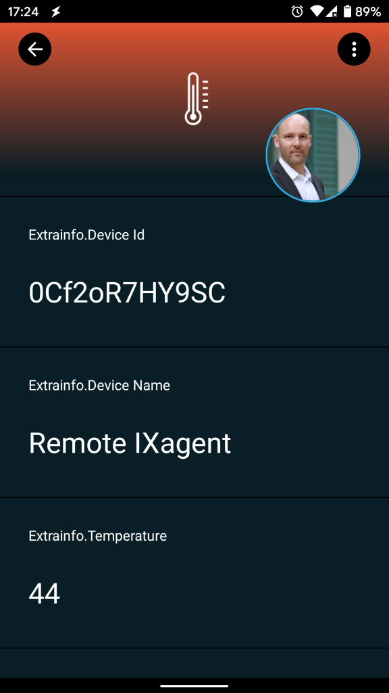
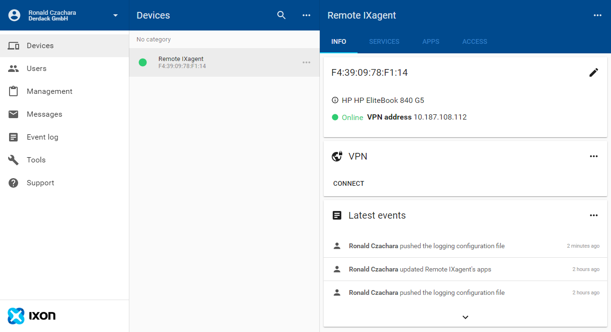
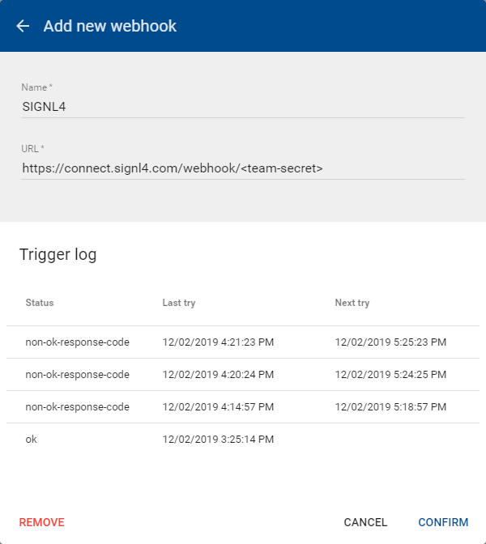

# Mobile alerting with tracking & escalation for IXON

Mobile alerting with tracking, duty planning and escalation for IXON.

## Why SIGNL4

IXON is an all-in-one solution for seamless integration between cloud, edge connectivity and machine. The no-code IIoT platform offers remote access (VPN), cloud data logging, data visualization and more. Accessing machine data becomes quick and easy. Pairing this powerful IoT platform with SIGNL4 can enhance your daily operations with an extension to your team on the shop floor or in the field.



## How it Works

All it takes to pair IXON and SIGNL4 is a webhook in your IXON platform that is triggered each time a relevant message appears. This will send the respective data to SIGNL4 and thus to alert the responsible team.

## Integration Capabilities

- Service engineers alerted via mobile push, text and voice
- Integration with SIGNL4 via webhook or email (SMTP)
- Staff can acknowledge and take ownership for critical events that occur
- Alerts are escalated in case of no response
- Communicate within an alert to address a particular problem
- Tracking and visibility of problem solutions
- Integrated on-call duty planning
- Alert on critical IoT device states
- Two-way integration to interact or set the device state

## Scenarios

- Industrial IoT
- Industry 4.0
- IoT Service Alerting
- IoT Device Management
- IT, Manufacturing, Utility, Oil and Gas, Agriculture, etc.

## How To Integrate

### Integrating SIGNL4 with IXON

In our example we use the IXagent, the software agent for IXON Cloud, to simulate temperature data. When the temperature is too high we send an alert to our SIGNL4 team. You can use an IXON Router as well.

SIGNL4 is a mobile alert notification app for powerful alerting, alert management and mobile assignment of work items. Get the app at https://www.signl4.com.


### Prerequisites

A SIGNL4 (https://www.signl4.com) account

An IXON (https://www.ixon.cloud) account

An IXON Router or IXagent (https://www.ixon.cloud/iiot-platform/connectivity-products/ixagent-embedded-agent)

#### Integration Steps

1. Connect the Device  

First of all you need to connect your device to the IXON Cloud. This can be the physical IXON Router or the embedded IXagent which is software. In our example we use the latter one and you can request the installer as well as a description on how to connect it here: https://www.ixon.cloud/iiot-platform/connectivity-products/ixagent-embedded-agent.

Once you have connected your device it will appear in your IXON platform.



2. Configure the Webhook  

In the IXON platform under Messages -> Settings -> Webhooks add a new webhook. You just need to configure your SIGNL4 webhook URL including your team secret here.



3. Add the Data Source  

In order  to add the data source you can go to your device, then to the Services tab and add a new service. Enter a name and IP address (can be random but you will need the IP address later). Add a data source with protocol LoggerAPI and a password (you will need the password later).

Please note that this step might differ depending depending on the agent.

4. Configure Cloud Notify  

Now you need to configure Cloud Notify. Therefore, go to your device and then to Apps -> Cloud Notify and add a new alarm. Here you can specify the conditions. You can even specify instruction on how to resolve the issue.

5. Test It  

This is it. You can now test your IoT scenario by simulating the temperature change. You will then receive an alert in your SIGNL4 app.

The simulation might differ depending on the agent you use. In our example we use the following console commands to connect to the device and then to set the temperature values.

```
HELO Windows 10 Pro/18362 HP/HP EliteBook 840 G5 IXagent for Windows/1.0.4 (libixagent/0.8.0; OpenSSL/1.1.1b; OpenVPN/2.4.6 [OCC] [OpenSSL/1.1.0h via --version]; stunnel/5.49; libixlogger/0.4.0)

DEVC <device-id> <password>
DEVC OK

@1=44
@1=44
@1=42
@1=2
@1=44
@1=1
@1=44
@1=1
```

You can find a sample in GitHub:
https://github.com/signl4/signl4-integration-ixon
